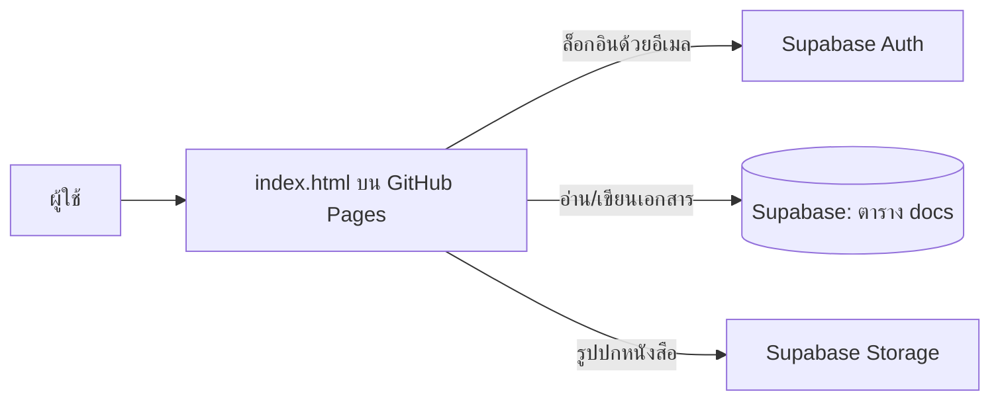

# 🧭 แผนที่การเรียน DA

เว็บส่วนตัวสำหรับเรียนสาย Data Analyst ด้วยตัวเอง: แผนการเรียน 3 เดือน, จับเวลาแบบละเอียด, ปฏิทิน, คิวทบทวน, คลังการอ่าน, ติดตามการสมัครงาน และสถิติการเรียนของตัวเอง

**เปิดใช้:** https://okodomoo1125.github.io/da-map/

## ทำงานยังไง

1. หน้าเว็บทั้งหมดอยู่ในไฟล์เดียว `index.html`
2. ล็อกอินด้วยลิงก์ในอีเมล
3. ข้อมูลเก็บเป็นเอกสารในตาราง `docs` ของ Supabase อ่านเขียนได้เฉพาะบัญชีเจ้าของ (Row Level Security)
4. เปิดจากหลายเครื่องได้ ข้อมูลซิงก์กัน

## อัปเดตเว็บ

- **แก้เนื้อหาหรือโจทย์:** ใช้ปุ่ม ✎ ในเว็บ ไม่ต้องแก้ไฟล์
- **แก้ฟีเจอร์:** แทนไฟล์ `index.html` แล้ว commit (หรือสั่งผ่าน Claude Code) รอราว 1 นาที แล้วรีเฟรชด้วย ⌘ + Shift + R
